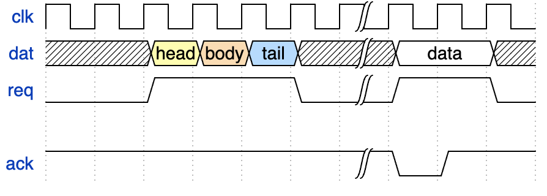
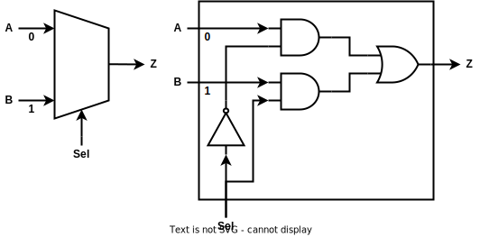

# Title

## SubTitle


---

# 1.1 Block Diagram

https://app.diagrams.net/


---

# 1.2 Timing Diagram

https://wavedrom.com

코드를 이용해 타이밍 다이어그램을 그려주는 프로그램

```
{signal: [
  {name: 'clk', wave: 'p.....|...'},
  {name: 'dat', wave: 'x.345x|=.x', data: ['head', 'body', 'tail', 'data']},
  {name: 'req', wave: '0.1..0|1.0'},
  {},
  {name: 'ack', wave: '1.....|01.'}
]}
```



---

# 1.3 Documentation

Notion, confluence, markdown을 활용하여 문서화 작업

http://notion.so

https://start.atlassian.com

https://typora.io


---

# 2 Mux 2-to-1



```verilog
module mux_2to1(
  input A,
  input B,
  input Sel,
  output Z
);
  assign Z = ((~Sel) & A)|(Sel & B); 
endmodule
```

**continuos assignment(assign문)를 활용하여 gatelevel로 구현**


